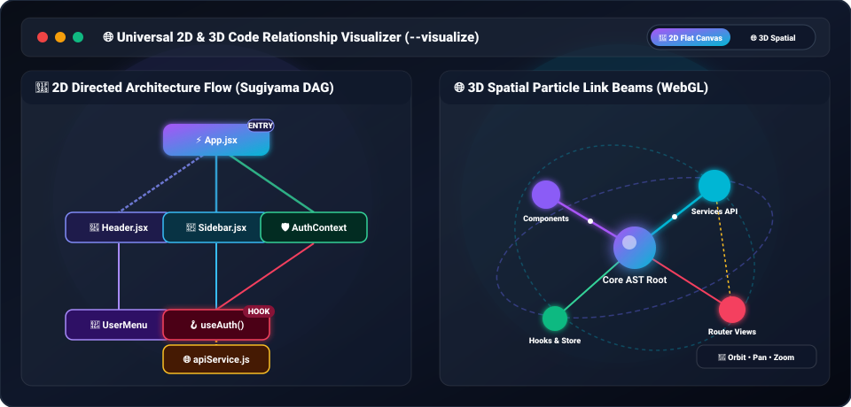

<p align="center">
  <a href="https://github.com/SKThakor137/Project-Tree">
    
  </a>
  <h1 align="center">🌳 project-tree-md</h1>
  <p align="center">
    <strong>Enterprise AI-Ready Project Intelligence & 2D/3D Code Visualizer Suite</strong><br>
    <em>Instantly map codebases for Cursor, Claude, ChatGPT & Developers. Generates Interactive Mind Maps, 2D/3D Code Graphs, Markdown, JSON, HTML, SVG, Mermaid, ZIP Bundles in 1-Second. Zero Dependencies. Node.js 20+.</em>
  </p>
  <p align="center">
    <a href="https://www.npmjs.com/package/project-tree-md"></a>
    <a href="https://www.npmjs.com/package/project-tree-md"></a>
    <a href="https://github.com/SKThakor137/Project-Tree/stargazers"></a>
    <a href="https://github.com/SKThakor137/Project-Tree"></a>
    <a href="https://github.com/SKThakor137/Project-Tree/blob/main/LICENSE"></a>
  </p>
</p>

<p align="center">
  <a href="#-key-features--capabilities">Top Features</a> •
  <a href="#-quick-start">Quick Start</a> •
  <a href="#-ai-integration--prompt-context-generator">AI Prompt Suite</a> •
  <a href="#-2d--3d-code-architecture-graph---visualize">2D/3D Code Graph</a> •
  <a href="#-interactive-mind-map---mindmap">Mind Map</a> •
  <a href="#-dedicated-task-outputs--export-system">Dedicated Outputs</a> •
  <a href="#-configuration-file-project-treeconfigjson">Configuration</a> •
  <a href="#-programmatic-api">API Usage</a>
</p>

---

## 🔥 Key Features & Capabilities

* 🤖 **AI Prompt & Context Generator**: Create token-optimized architecture context for ChatGPT, Claude, Cursor & Copilot (`ptree ai`, `ptree prompt`, `ptree ai-rules`).
* 🌐 **Interactive 2D & 3D Code Graph**: Explore codebase imports, exports, and module relationships with 3D WebGL spatial sphere and flat 2D canvas (`ptree --visualize`).
* 🧠 **Interactive Horizontal Mind Map**: Auto-layout node hierarchy with curved Bezier connectors, pan/zoom, and live JSON data editor (`ptree --mindmap`).
* 📁 **Dedicated Output File Names**: Every command writes to its own task-specific file to prevent overwriting (`GIT_STATUS_TREE.md`, `CHANGED_FILES_TREE.md`, `SORTED_TREE.md`, `FILE_HASHES.md`, etc.).
* 🌿 **Git Integration & Changed Files Filter**: Highlight modified, added, and untracked files (`[Modified]`, `[Added]`, `[Untracked]`) or filter tree to changed files only (`ptree --git-status`, `ptree --changed-only`).
* 🔍 **Content Hashing & Duplicate File Analyzer**: Compute cryptographic checksums (`md5`, `sha256`) and detect duplicate files (`ptree --hash`, `ptree --duplicates`).
* 📏 **Lines of Code & File Size Details**: Inspect line counts, byte sizes, permissions, and OS owner for every file (`ptree --details`, `ptree --permissions`, `ptree --owner`).
* 📦 **ZIP Bundle Generator & Multi-Format Exporter**: Package all visual and structured reports into a single ZIP archive (`ptree --bundle`).
* ⚡ **Zero Dependencies**: 100% pure Node.js standard library with lightning-fast execution.

---

## 🚀 Quick Start (No Install Required)

Run directly in any project directory with `npx`:

| Feature / Command | Command | Dedicated Output File |
| :--- | :--- | :--- |
| 📄 **Markdown Tree** *(Default)* | `npx ptree` | `PROJECT_STRUCTURE.md` |
| 🤖 **AI Context Generator** | `npx ptree ai` | `AI_CONTEXT.md` |
| 💬 **AI Prompt Generator** | `npx ptree prompt` | `AI_PROMPT.md` |
| 🌐 **2D/3D Code Relationship Graph** | `npx ptree --visualize` | `CODE_GRAPH.html` *(auto-opens)* |
| 🧠 **Interactive Mind Map** | `npx ptree --mindmap` | `PROJECT_MINDMAP.html` *(auto-opens)* |
| 📏 **Lines of Code & File Size** | `npx ptree --details` | `FORMATTED_TREE.md` |
| 🌿 **Git Status Badges** | `npx ptree --git-status` | `GIT_STATUS_TREE.md` |
| 🔄 **Changed Files Only** | `npx ptree --changed-only` | `CHANGED_FILES_TREE.md` |
| 🔍 **File Checksums** | `npx ptree --hash sha256` | `FILE_HASHES.md` |
| 📋 **Duplicate File Finder** | `npx ptree --duplicates` | `PROJECT_DUPLICATES.md` |
| 🔀 **Sorted Tree** | `npx ptree --sort size` | `SORTED_TREE.md` |
| 🏷️ **File Attributes** | `npx ptree --modified --permissions` | `FILE_ATTRIBUTES.md` |
| 📊 **Terminal Analytics Dashboard** | `npx ptree --dashboard` | *(Terminal Stdout Report)* |
| 📦 **ZIP Package Bundle** | `npx ptree --bundle` | `project-analysis.zip` |

---

## 🤖 AI Integration & Prompt Context Generator

Generate structured codebase context tailored for LLM prompt windows:

```bash
# Generate comprehensive AI Context for Cursor / Claude
npx ptree ai

# Generate conversational system prompt snippet
npx ptree prompt

# Generate repository AI coding rules & agent guidelines
npx ptree ai-rules

# View total lines of code & token estimations
npx ptree tokens
```

---

## 🌐 2D & 3D Code Architecture Graph (`--visualize`)

Transform any codebase into dynamic, interactive 2D canvas & 3D WebGL graphs showing complete architecture, dependency graphs, state flows, hooks, models, and service relationships:

<p align="center">
  
</p>

```bash
npx ptree --visualize
```

---

## 🧠 Interactive Horizontal Mind Map (`--mindmap`)

Transform your codebase into a clean, horizontal node-based interactive Mind Map (`PROJECT_MINDMAP.html`) with Bezier line connectors and live node editing:

<p align="center">
  
</p>

```bash
npx ptree --mindmap
```

---

## 📁 Dedicated Task Outputs & Export System

Every option flag automatically outputs to a dedicated unique filename to ensure your reports never overwrite each other:

```bash
# Line counts and file sizes
npx ptree --details            # -> FORMATTED_TREE.md

# Git status badges
npx ptree --git-status         # -> GIT_STATUS_TREE.md

# Filter to changed files only
npx ptree --changed-only       # -> CHANGED_FILES_TREE.md

# Cryptographic content hashes
npx ptree --hash sha256        # -> FILE_HASHES.md

# Duplicate files analysis
npx ptree --duplicates         # -> PROJECT_DUPLICATES.md

# Depth limit tree
npx ptree --depth 2            # -> DEPTH_TREE.md

# Custom exclude pattern
npx ptree --exclude "assets"   # -> FILTERED_TREE.md
```

---

## ⚙️ Configuration File (`project-tree.config.json`)

Customize behavior globally or per-project using a `project-tree.config.json` file in your root folder:

```json
{
  "theme": "emoji",
  "details": true,
  "respectIgnore": true,
  "exclude": "dist|build|coverage",
  "maxDepth": 5
}
```

---

## 💻 Programmatic API

Use `project-tree-md` inside your Node.js scripts and workflows:

```javascript
const { generateTree, scan, computeStats } = require('project-tree-md');

// Generate complete project markdown
const result = generateTree({
  rootDir: process.cwd(),
  details: true,
  theme: 'emoji'
});

console.log(result.markdown);
```

---

## 📄 License

Distributed under the MIT License. See [LICENSE](LICENSE) for more details.
