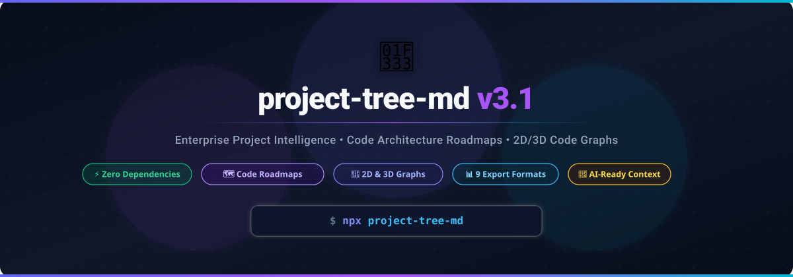
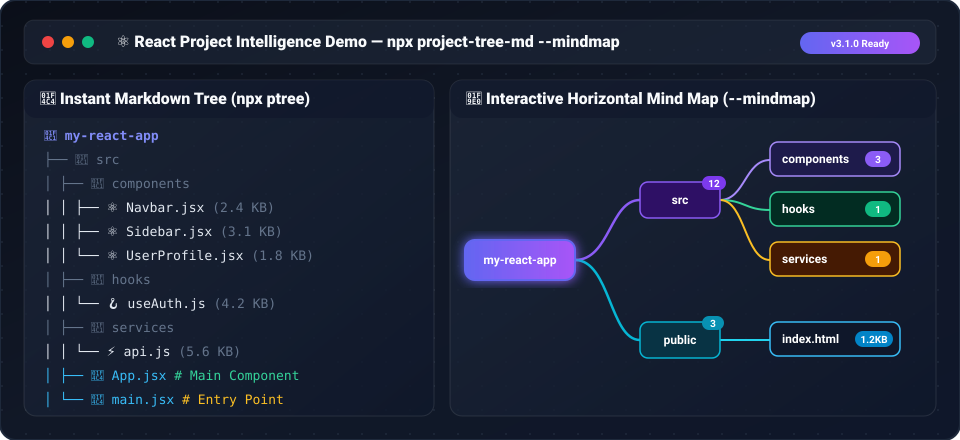

<p align="center">
  <a href="https://github.com/SKThakor137/Project-Tree">
    
  </a>
  <h1 align="center">🌳 project-tree-md v3.1</h1>
  <p align="center">
    <strong>Enterprise AI-Ready Project Intelligence & 2D/3D Code Visualizer Suite</strong><br>
    <em>Instantly map codebases for Cursor, Claude, ChatGPT & Developers. Generates Interactive Mind Maps, 2D/3D Code Graphs, Markdown, JSON, HTML, SVG, Mermaid, CSV, TSV, XML, YAML, PlantUML & ZIP Bundles in 1-Second. Zero Dependencies. Node.js 20+.</em>
  </p>
  <p align="center">
    <a href="https://www.npmjs.com/package/project-tree-md"></a>
    <a href="https://www.npmjs.com/package/project-tree-md"></a>
    <a href="https://github.com/SKThakor137/Project-Tree/stargazers"></a>
    <a href="https://github.com/SKThakor137/Project-Tree"></a>
    <a href="https://github.com/SKThakor137/Project-Tree/blob/main/LICENSE"></a>
  </p>
</p>

<p align="center">
  <a href="#-quick-start">Quick Start</a> •
  <a href="#-interactive-horizontal-mind-map----mindmap">Interactive Mind Map</a> •
  <a href="#-universal-code-relationship-visualizer----visualize">Interactive Code Graph</a> •
  <a href="#-why-project-tree-md">Why Us?</a> •
  <a href="#-bundle-export-workflow---bundle">ZIP Bundles</a> •
  <a href="#-programmatic-api">API Usage</a>
</p>

---

## 🚀 Instant Usage (No Install Required)

### 1. Simple Markdown Tree (Default)
Generate `PROJECT_STRUCTURE.md` and copy project tree to clipboard immediately:

```bash
npx ptree
```

### 2. Interactive Horizontal Mind Map (`--mindmap`)
Generate a dynamic, node-based interactive HTML Mind Map (`PROJECT_MINDMAP.html`):

```bash
npx ptree --mindmap
```

### 3. 2D & 3D Interactive Code Relationship Graph (`--visualize`)
Generate 2D Canvas & 3D WebGL Code Architecture Graph (`CODE_GRAPH.html`):

```bash
npx ptree --visualize
```

<p align="center">
  
</p>

---

## 🌐 Universal 2D & 3D Code Relationship Visualizer (`--visualize`)

Transform any codebase into dynamic, interactive 2D canvas & 3D WebGL graphs showing complete architecture, dependency graphs, state flows, hooks, models, and service relationships — all in a single HTML file (`CODE_GRAPH.html`) with instant mode switching (`🎨 2D | 🌐 3D`)!

```
                     App.jsx (React)
                  /         |        \
                 ▼          ▼         ▼
             Header     Sidebar   AuthContext
               │            │         │
               ▼            ▼         ▼
           UserMenu      NavList   useAuth()
                                      │
                                      ▼
                                userService.js (API)
```

### ⚡ Visualizer Capabilities (`npx ptree --visualize`)

* 🎨 **Instant 2D & 3D Mode Switcher**: Toggle seamlessly between **2D Flat Canvas** and **3D WebGL Spatial Sphere** views right from the toolbar.
* 🎨 **5 Layout Engines (2D)**: Switch on-the-fly between **DAG (Sugiyama)**, **Force-Directed (Barnes-Hut)**, **Tree**, **Radial**, and **Horizontal Flow**.
* 🌌 **3D Force & Particle Link Beams**: Full 3D camera orbit, rotation, pan, zoom, glowing nodes, and directional particle animation flows.
* 🚀 **Multi-Language Support**: Framework-agnostic parsing for **20+ languages and frameworks** (React, Next.js, Vue, Angular, Svelte, Laravel, PHP, Node.js, Express, NestJS, Flutter, Dart, React Native, Python, Django, FastAPI, Java, Spring Boot, .NET/C#, Go, Rust).
* 🔍 **Real-Time Instant Search & Minimap**: Live query filtering with auto-centering (`Ctrl+F`) and draggable minimap.
* 📑 **Slide-out Detail Panel**: Inspect code metrics, file size, line counts, incoming imports, outgoing exports, and dependencies.
* 📷 **PNG & JSON Export**: Export high-res vector PNG diagrams or raw `CODE_GRAPH.json` models.

---

## 🔥 Why `project-tree-md`?

Most directory tree generators only print basic text folders. **`project-tree-md` is a complete project intelligence suite** designed for modern developers and AI workflows (ChatGPT, Claude, Gemini, Cursor, Copilot).

```
                  ┌──────────────────────────────────────────────┐
                  │               npx ptree                      │
                  └──────────────────────┬───────────────────────┘
                                         │
       ┌──────────────────┬──────────────┼──────────────┬──────────────────┬──────────────────┐
       │                  │              │              │                  │                  │
 🌐 Code Visualizer 📄 Markdown Tree 📊 9 Export Formats 📦 ZIP Bundle  🤖 AI Context   🌐 HTML Dashboard
```

### ⚡ Key Capabilities

* 🌐 **Universal 2D & 3D Code Relationship Visualizer (`--visualize`)**: Generate a unified 2D canvas & 3D WebGL interactive visualizer (`CODE_GRAPH.html`) with instant mode switching.
* 📄 **9 Export Formats**: Export as Markdown, JSON, HTML, SVG, Mermaid, **CSV**, **TSV**, **XML**, **YAML**, and **PlantUML**.
* 🎨 **Custom Theme Engine (`--theme`)**: 12 built-in presets (`unicode`, `ascii`, `box`, `emoji`, `compact`, `rounded`, `double`, `minimal`, `classic`, `dotted`, `heavy`, `thin`) + user JSON theme loading.
* 🎯 **Custom Icon Engine (`--icons`)**: 100+ file extensions mapped with emoji icons + custom JSON override support.
* 🔀 **Tree Sorter Engine (`--sort`)**: 8 sorting modes (`alpha`, `folders-first`, `files-first`, `extension`, `size`, `modified`, `created`, `natural`).
* 🔎 **Duplicate File Detector (`--duplicates`)**: Finds duplicate files across the repository by filename or content hash (`md5`, `sha1`, `sha256`).
* ⚙️ **Config File Support**: Automatically loads settings from `project-tree.config.json`, `project-tree.config.js`, `.projecttreerc`, or `package.json#projectTree`.
* 🔌 **Plugin API**: Extensible hooks for custom renderers, scanner transformers, and tree formatters.
* 🛡️ **Nested `.gitignore` Shield**: Discovers nested `.gitignore` files recursively and respects subfolder ignore rules.
* 📦 **ZIP Analysis Bundles (`--bundle`)**: Export analysis reports into a single `project-analysis.zip` archive.
* ⚡ **Zero Runtime Dependencies**: Built 100% with Node.js standard modules. Ultra-fast, lightweight, and safe.

---

## 🏆 Feature Comparison

| Feature | `project-tree-md` | `tree` (Unix) | `tree-cli` | `directory-tree` |
| :--- | :---: | :---: | :---: | :---: |
| **Interactive Code Visualizer** | ✅ **2D Canvas & 3D WebGL** | ❌ No | ❌ No | ❌ No |
| **Export Formats** | ✅ **9 Formats** (MD, JSON, HTML, SVG, Mermaid, CSV, TSV, XML, YAML, PlantUML) | ❌ Text only | ❌ MD/JSON | ❌ JSON |
| **Zero Dependencies** | ✅ **100% Zero** | ✅ System | ❌ Heavy | ❌ Heavy |
| **Custom Themes & Icons** | ✅ **12 Presets + JSON** | ❌ No | ❌ No | ❌ No |
| **Sorting Strategies** | ✅ **8 Modes** (Natural, Folders-first, Size, Dates) | ⚠️ Basic | ❌ No | ❌ No |
| **Duplicate File Finder** | ✅ **ByName & Hash** | ❌ No | ❌ No | ❌ No |
| **Config & Plugin System** | ✅ **JSON/JS Config + API** | ❌ No | ❌ No | ❌ No |
| **ZIP Bundle Export** | ✅ **1-Click ZIP** | ❌ No | ❌ No | ❌ No |
| **AI LLM Context & Tokens** | ✅ **Built-in** | ❌ No | ❌ No | ❌ No |
| **Nested Gitignore Support** | ✅ **Subfolder-aware** | ❌ Manual | ⚠️ Limited | ❌ No |

---

## ⚡ Quick Examples & Commands

### 1. Interactive 2D & 3D Code Relationship Visualizer
```bash
# Generate unified 2D & 3D interactive graph (CODE_GRAPH.html)
npx ptree --visualize

# Export Universal Graph Model JSON
npx ptree --graph-json
```

### 2. Export Formats (CSV, TSV, XML, YAML, PlantUML)
```bash
# Export as CSV flat table
npx ptree --csv

# Export as YAML tree
npx ptree --yaml

# Export as PlantUML diagram
npx ptree --plantuml
```

### 3. Tree Sorting & File Hashing
```bash
# Sort folders first, then natural alpha
npx ptree --sort folders-first

# Sort by file size descending
npx ptree --sort size --sort-order desc

# Include file permissions, modification date, and SHA-256 hash
npx ptree --permissions --modified --hash sha256
```

### 4. Duplicate File Detection
```bash
# Find duplicate filenames across project
npx ptree --duplicates

# Find duplicate files by SHA-256 content hash
npx ptree --duplicates --hash sha256
```

### 5. Custom Themes & Icons
```bash
# Use rounded box-drawing characters
npx ptree --theme rounded

# Use custom theme JSON
npx ptree --theme ./my-theme.json --icons ./my-icons.json
```

---

## 📦 Bundle Export System (`--bundle`)

Generate a comprehensive project analysis package containing report files:

```bash
npx ptree --bundle --output-dir reports/
```

---

## 🎯 Complete CLI Options (v3.0)

```text
project-tree-md — Enterprise AI-Ready Project Analysis Suite (v3.0)

Usage:
  npx ptree [options]
  npx ptree compare <pathA> <pathB>

Bundle & Export System:
  --bundle [list]         Generate ZIP package with all or selected reports (e.g. --bundle html,json,svg)
  --export [list]         Export selected reports to directory (e.g. --export html,json)
  --export-all            Export all individual analysis reports
  --output-dir <dir>      Output directory for exports and ZIP bundles
  --no-write, --stdout    Print to console without writing default output files

Output & Tree Customization:
  -o, --out <file>        Output filename              (default: PROJECT_STRUCTURE.md)
  -L, --depth <n>         Max depth to traverse        (default: unlimited)
  -I, --exclude <regex>   Custom exclude pattern       (default: standard ignores)
  --theme <name|path>     Tree theme                   (unicode|ascii|emoji|box|rounded|double|minimal)
  --icons <path>          Custom icons JSON file       (override extension -> icon mapping)
  --sort <mode>           Sort entries                 (alpha|folders-first|files-first|extension|size|modified|created|natural)
  --sort-order <asc|desc> Sort direction              (default: asc)
  --details               Show file size & extension
  --summarize             Extract & show inline file comment summaries
  --flow                  Generate architecture execution flow & role map
  --visualize, --graph    Generate 2D & 3D Interactive Code Relationship Graph HTML
  --graph-json            Export universal graph model as JSON
  --compress              Compress single-child dirs
  --collapse <n>          Collapse dirs with >n files
  --dashboard             Show rich stats dashboard
  --architecture          Enable advanced architecture parsing & metrics

File Metadata & Hashing:
  --hash [algo]           Compute file content hashes  (md5|sha1|sha256)
  --permissions           Show file permissions        (rwxr-xr-x format)
  --owner                 Show file owner UID/GID
  --modified              Show last modified dates
  --created               Show file creation dates
  --duplicates            Detect & report duplicate files (by name or hash)

Export Formats:
  --json                  Export as JSON
  --html                  Export as collapsible HTML with Download Center
  --svg                   Export as SVG diagram
  --mermaid               Export as Mermaid graph
  --csv                   Export as CSV flat table
  --tsv                   Export as TSV flat table
  --xml                   Export as well-formed XML
  --yaml                  Export as YAML document
  --plantuml              Export as PlantUML diagram

Limits & Controls:
  --max-files <n>         Stop after scanning N files
  --max-folders <n>       Stop after scanning N folders
  --config <path>         Path to custom config file
  --respect-ignore        Respect nested .gitignore files

AI Features:
  --ai                    Generate AI context document
  --prompt                Generate AI-ready prompt
  --tokens                Output AI context token count & cost estimation

Other Options:
  -i, --interactive       Interactive guided setup
  -h, --help              Show this help
  -v, --version           Show version
```

---

## 📦 Programmatic Node.js API

Integrate `project-tree-md` into your build tools, scripts, or CI/CD pipelines:

```javascript
const {
  generateTree,
  generateUniversalGraph,
  toGraphVisualizerHtml,
  toCsv,
  toTsv,
  toXml,
  toYaml,
  toPlantUml,
  sortTree,
  findDuplicatesByName,
  findDuplicatesByHash,
  loadConfig,
  registerRenderer,
} = require('project-tree-md');

// 1. Generate Tree with Sorter & Metadata
const result = generateTree({
  rootDir: process.cwd(),
  sort: 'folders-first',
  modified: true,
  permissions: true,
  hash: 'sha256',
});

console.log(result.coloredTreeText);

// 2. Export as YAML & PlantUML
const yamlString = toYaml(result.tree, result.stats);
const pumlString = toPlantUml(result.tree, result.stats);

// 3. Find Duplicates
const duplicates = findDuplicatesByName(result.tree);
console.log(`Found ${duplicates.length} duplicate file groups`);
```st graph2dHtml = toGraphVisualizerHtml(graphModel, 'My Project');
const graph3dHtml = toGraph3dVisualizerHtml(graphModel, 'My Project');
const graphJson = toGraphJson(graphModel);

console.log(`Graph Nodes: ${graphModel.nodes.length}, Edges: ${graphModel.edges.length}`);

// 2. Generate full tree
const result = generateTree({
  rootDir: process.cwd(),
  flow: true,
  summarize: true,
});

console.log(result.coloredTreeText);

// 3. Generate customized ZIP bundle programmatically
const bundle = generateBundle({
  rootDir: process.cwd(),
  outputDir: 'dist/reports',
  bundleName: 'my-app-analysis.zip',
  exportList: ['graph', 'html', 'json', 'svg'],
});

console.log(`ZIP created at: ${bundle.zipPath} (${bundle.sizeMb} MB)`);
```

---

## 📁 Monorepo & Framework Auto-Detection

Automatically classifies and detects 30+ technologies:
- **Monorepos**: TurboRepo, Nx, pnpm Workspaces, Yarn Workspaces, Lerna.
- **Frameworks**: React, Next.js, Vue, Nuxt, Angular, Svelte, Express, NestJS, FastAPI, Django, Laravel, Spring Boot, Flutter/Dart, .NET, Go, Rust.
- **Languages**: TypeScript, JavaScript, Python, Go, Rust, Java, C/C++, PHP, Ruby, Dart, C#.
- **Tools**: Docker, GitHub Actions, CI/CD, TailwindCSS, Vite, Webpack, ESLint, Prettier, Jest, Vitest.

---

## 🤝 Contributing

Contributions, bug reports, and feature requests are welcome!  
Feel free to check out the [Issues Page](https://github.com/SKThakor137/Project-Tree/issues).

---

## 📄 License

Distributed under the MIT License. See [LICENSE](LICENSE) for details.

© [SKThakor137](https://github.com/SKThakor137). Built with ❤️ for developers worldwide.
